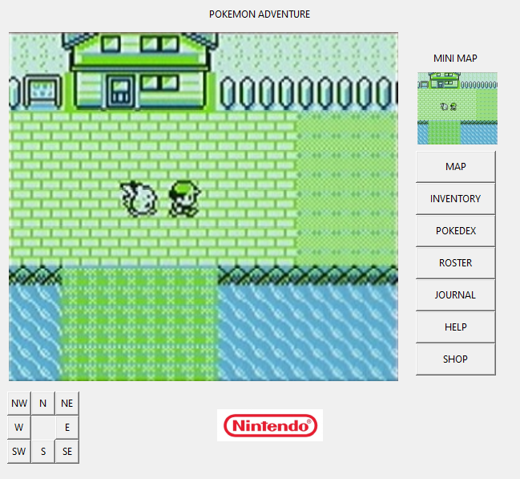

# 041-more-gui
 
Task 1
Create the basic interface included in task1.png

Task 2
Create the GUI that has been shown in the image below:



Some things that can help you out:
To center text in a button use the "anchor" attribute:
```
b1 = tk.Button(parent,text="CONTENT",anchor="center")
```

The amount of space a widget takes up on screen can be set using the place method:
```
b1.place(x=20,y=30,width=50,heigh=40)
```